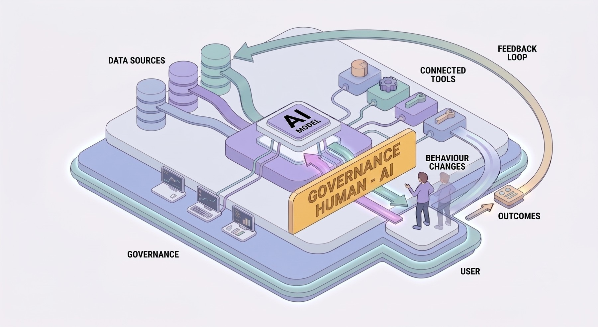

# Revisor de la capa de interacción humano-IA

**Audita el salpicadero de un sistema de IA, no el motor.**



Las herramientas de gobernanza de IA que existen hoy (watsonx.governance, Fiddler, Arize…)
auditan el **motor**: sesgo, precisión, deriva, explicabilidad técnica. Casi nadie mira el
**salpicadero**: cómo el sistema le presenta el resultado a la persona, cómo se calibra su
confianza, si el diseño induce *automation bias*, cómo se captura el *override*, la fatiga de
alerta, el onboarding. Y el salpicadero es justo donde un profesional decide si se fía del
modelo, lo corrige o lo ignora. Hoy eso se revisa a mano, con una hoja de cálculo. Este
proyecto lo automatiza.

> ¿Lo quieres en lenguaje llano, como se lo contarías a un cliente? → **[docs/PRODUCTO.md](docs/PRODUCTO.md)**

## Qué hace

Le das la descripción de un sistema —qué hace, cómo se le presenta al usuario y **qué cuentan
los que lo usan**— y te devuelve una lista de problemas de la capa de interacción. No problemas
de manual: cada hallazgo va **anclado a tres cosas**:

1. una **guía reconocida** que incumple,
2. el **punto concreto** del sistema donde ocurre,
3. la **evidencia** sacada de la propia documentación.

Si no puede apoyar un hallazgo en evidencia, no lo suelta. Un informe lleno de "mejora la
explicabilidad" no sirve, porque vale para cualquier sistema; esto señala "aquí, en esta
pantalla, el score aparece prerrellenado y empuja al médico a aceptarlo sin pensar".

Las guías van **masticadas**: usa las 18 de Microsoft (**HAX-18**) y el guidebook de Google
(**PAIR**) —el estándar de facto— traducidas a hallazgos accionables. No necesitas conocerlas.

## Cómo se alimenta: tres plantillas

No hace falta redactar un informe. El sistema se nutre de **tres plantillas** que rellenan las
partes interesadas:

- **[Perfil técnico](templates/01_ficha_sistema__perfil_tecnico.md)** — quien implementa o mantiene el sistema.
- **[Experiencia de uso](templates/02_experiencia_uso__usuario_final.md)** — **el usuario final**. Esta es la pieza que nadie más audita: el testimonio real de quien convive con la IA (¿la acepta por inercia? ¿puede corregirla? ¿la ignora?).
- **[Inventario de documentos](templates/03_inventario_documentos.md)**.

Esas tres respuestas **son** la entrada. El diferencial está en la segunda: cruzar lo que el
equipo técnico *cree* que pasa con lo que el usuario *vive*, porque ese desajuste es, en sí
mismo, una señal de la capa de interacción.

Y no hay que tocar JSON. Rellenas las plantillas en markdown y `interaction-review ingerir` te
arma el dossier solo, así construir la entrada no cuesta lo mismo que auditar a mano.

¿Ya tienes un PDF, una model card o la transcripción de una entrevista con el usuario?
`interaction-review prerrellenar` se lo pasa al LLM para que rellene la plantilla (la **ficha** desde el
documento técnico, la **experiencia** desde la entrevista) con lo que consta, y **solo eso**: lo que no
aparece lo deja en blanco, no se lo inventa. Tú revisas y corriges, y de ahí a `ingerir`. Este paso sí
usa API; la ingesta de plantillas ya rellenas, no.

## ¿Funciona?

Sí, y está medido contra **casos held-out documentados por fuentes independientes**, en
**8 sectores** (sanidad, aviación, justicia, finanzas, administración pública, RRHH, bienestar,
discapacidad):

| Prueba | Resultado |
|---|---|
| Caso clínico real (golden de un experto humano) | redescubre **13-14 de 15** problemas, precisión ~100% |
| Held-out en varios sectores (justicia, aviación, RRHH, sanidad, moderación) | recall **0.80-1.00**, no es overfitting |
| Sistema **bien diseñado** (control de falsos positivos) | **0 hallazgos**, no inventa para parecer productivo |
| Robustez al fraseo (mismo caso, otras palabras) | recall estable, entiende y no pesca palabras clave |
| **Test duro**, n=3: golden de un órgano independiente (Royal Commission, un auditor estatal, un tribunal federal) + dossier en bruto, manos separadas | recall **0.70-0.90** (media ~0.79): recupera lo que señalaron sin verlo |
| **Número del producto**, medido con el pipeline reproducible y un **juez independiente** (otro modelo) | p3: recall **0.93**, precisión **0.96** |

El último es el que más me importa, porque no lo mide el mismo motor que genera. El juez es otro
modelo y el flujo es reproducible. Y lo hace con un **modelo barato** de generador. Repetido con **k=3**
pasadas el número aguanta (0.91 ± 0.055 de recall, 0.965 de precisión) y la barra entre casos se estrecha:
no era suerte de una sola corrida.

Y lo del testimonio no es una corazonada. Si al dossier le quitas la voz del usuario y dejas solo
la documentación técnica, el revisor deja de ver los problemas que solo esa voz revela: su recall
en ese grupo cae de **0.83 a 0.33**. Son justo los cognitivos, el exceso de confianza en la
máquina, el modelo mental equivocado, la alerta que salta en mal momento. La capa que ninguna
ficha técnica te va a contar.

Detalle y método: **[docs/RESULTADOS.md](docs/RESULTADOS.md)** (el experimento) ·
**[docs/RESULTADOS-testimonio.md](docs/RESULTADOS-testimonio.md)** (casos con testimonio real, test
duro n=3 y el número reproducible) · **[docs/RESULTADOS-ablacion-testimonio.md](docs/RESULTADOS-ablacion-testimonio.md)** (el efecto de la voz).

## En el idioma de quien te compra

HAX y PAIR son el estándar de diseño, pero quien aprueba la compra (gobernanza, calidad,
cumplimiento) no razona en HAX-G2, razona en AI Act y NIST. Así que el informe se traduce solo.
Con `--crosswalk`, cada hallazgo sale también mapeado a los artículos del **EU AI Act** (el 13 de
transparencia, el 14 de supervisión humana, que nombra el *automation bias* de forma explícita, el
86 de derecho a explicación) y a las subcategorías del **NIST AI RMF**. Deja de ser una crítica de
diseño y pasa a ser evidencia de conformidad que entra en su expediente. Es orientativo, no
dictamen legal, y así está dicho en el propio informe.

Y si hay que enseñarlo, `--format html` saca un informe autocontenido y presentable que imprime a
PDF sin depender de nada externo.

## Es un experimento con método, no humo

La pregunta de partida no fue "cómo construyo el agente" sino **si hace falta uno**. Antes de
construir nada grande se establecieron baselines simples y se midió: la complejidad solo se
justifica si **gana de forma medible**.

- Escalera: **B0** checklist determinista → **B1** prompt único → **P3** pipeline determinista → **A4** agente.
- Conclusión —un mapa, no un ganador único—: el **pipeline determinista + deduplicado** es lo
  robusto. El **agente moderno no se paga solo**: iguala en el mejor caso, pero pierde cuando la
  entrada se degrada (lo normal en una auditoría).
- Lección transversal: el eslabón frágil fue el **LLM-juez** (la medición), no el generador →
  barandillas deterministas en código.

Decisiones de diseño en **[docs/adr/](docs/adr/)**; plan de validación y limitaciones honestas
en **[docs/TESTPLAN.md](docs/TESTPLAN.md)**.

## Instalación

```bash
uv sync --extra dev
```

## Uso

```bash
# (Opcional) De un documento a una plantilla prerrellena con el LLM (revísala luego):
uv run interaction-review prerrellenar --doc ruta/model_card.pdf --tipo ficha       --out templates/01_relleno.md
uv run interaction-review prerrellenar --doc ruta/entrevista.txt  --tipo experiencia --out templates/02_relleno.md

# De las tres plantillas rellenas al Dossier (determinista, sin API):
uv run interaction-review ingerir \
    --ficha templates/01_relleno.md --experiencia templates/02_relleno.md \
    --inventario templates/03_relleno.md --out ruta/dossier.json

# Informe de hallazgos, con el mapeo normativo y en HTML listo para imprimir a PDF:
uv run interaction-review revisar --dossier ruta/dossier.json --approach p3 --dedup \
    --crosswalk --format html --out informe.html

# 'auto' (router de producto): b1 si el caso es fácil, p3+dedup si es difícil:
uv run interaction-review revisar --dossier ruta/dossier.json --approach auto

# Métricas contra un golden set (con LLM-juez):
uv run interaction-review comparar \
    --dossier ruta/dossier.json --golden ruta/answer_key.json \
    --approaches b0,b1,p3 --k 3 --save runs/salida.json
```

Approaches: `b0` (checklist, sin LLM) · `b1` (prompt único) · `p3` (pipeline, **el producto**) ·
`a4` (agente). `--dedup` consolida casi-duplicados (determinista); `--dedup-llm` es la capa
semántica opcional (gasta API). `--crosswalk` añade el mapeo a EU AI Act / NIST; `--format html`
saca el informe presentable. El comando `comparar` requiere `ANTHROPIC_API_KEY` (salvo solo `b0`),
o corre en local con `LLM_BACKEND=ollama`.

> **Local / Windows.** Para correr en local con [Ollama](https://ollama.com) antepón
> `LLM_BACKEND=ollama`. Si el Control de aplicaciones de Windows bloquea el lanzador `.exe`,
> invoca el módulo directamente: `uv run python -m interaction_review.cli ...`.

## Estructura

```
src/interaction_review/
  schemas.py        Contrato de datos (Dossier, Finding, GoldenIssue, ...)
  guidelines/       HAX-18 y PAIR como datos enlazables + regulatory_map.yaml (AI Act / NIST)
  approaches/       Escalera de approaches (b0/b1/b2/p3/p3n/a4)
  ingest.py         Plantillas rellenas -> Dossier (determinista, sin API)
  smart_ingest.py   Documento (PDF/model card) -> plantilla prerrellena (LLM; el humano revisa)
  dedup.py          Consolidación determinista de hallazgos (producto)
  dedup_llm.py      Capa semántica opcional (LLM)
  router.py         Enrutado 'auto' por dificultad
  regulatory.py     Crosswalk de los hallazgos a EU AI Act / NIST AI RMF
  ablation.py       Ablación del testimonio (dossier con voz vs sin voz)
  metrics.py        recall, precisión, genericidad, grounding, F-beta, recall por fuente
  report.py         Informe markdown · report_html.py Informe HTML autocontenido
  cli.py            Comandos ingerir / revisar / evaluar / comparar
docs/adr/           Decisiones de diseño (ADR-001..008)
data/external/      Casos held-out públicos (dossier + golden por caso)
data/golden/        PRIVADO, gitignored (caso clínico real)
templates/          Las tres plantillas de entrada
```

## Privacidad

El material clínico es privado y **nunca se versiona** (`data/golden/`, `data/private/`). Las
llamadas al LLM envían datos a la nube, así que el dossier debe estar **de-identificado** antes
de cualquier corrida con datos reales (ver [ADR-003](docs/adr/ADR-003-manejo-datos-phi.md)).

## Referencias

- Amershi et al. (2019), *Guidelines for Human-AI Interaction*, CHI. (HAX-18)
- Google PAIR, *People + AI Guidebook*.
